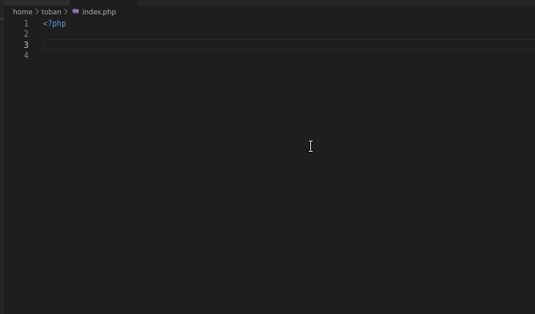

# vscode-mediawiki-localsettings

Idea to add LocalSettings.php suggestions into vscode



## Build and install into code

```sh
npm run ci
```

```sh
npm run compile
```

```sh
code --install-extension MediaWiki-Localsettings-<VersionName>.vsix
```
